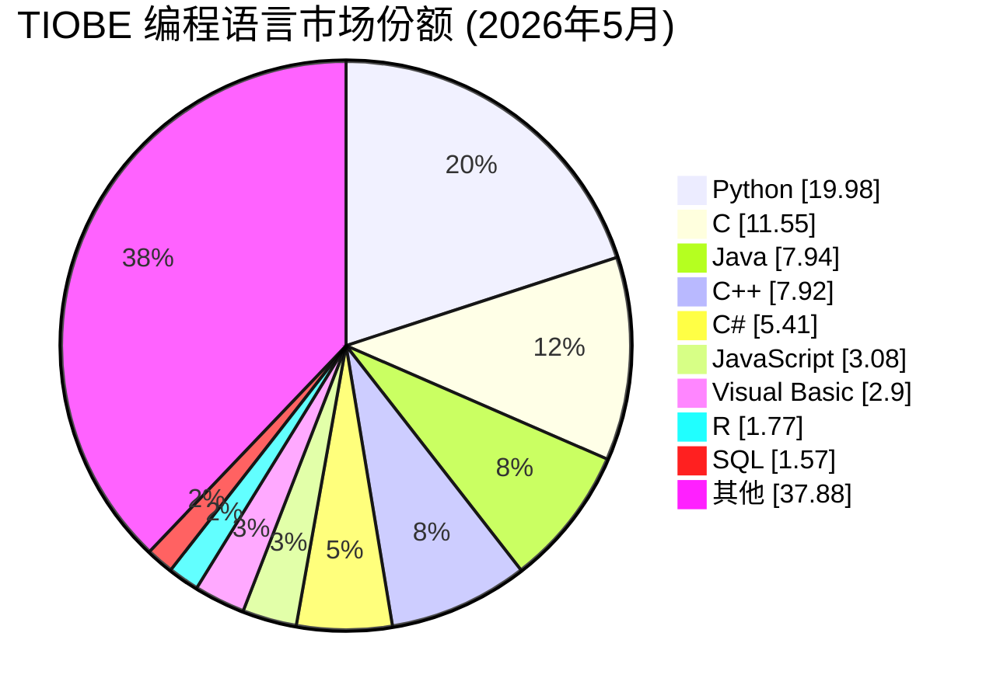
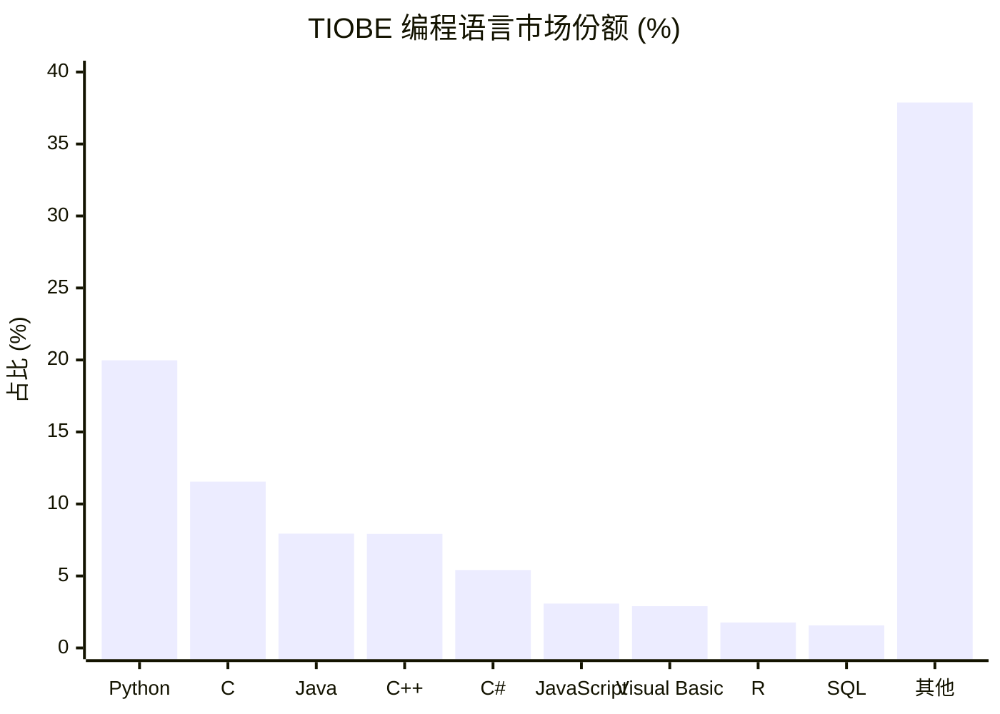
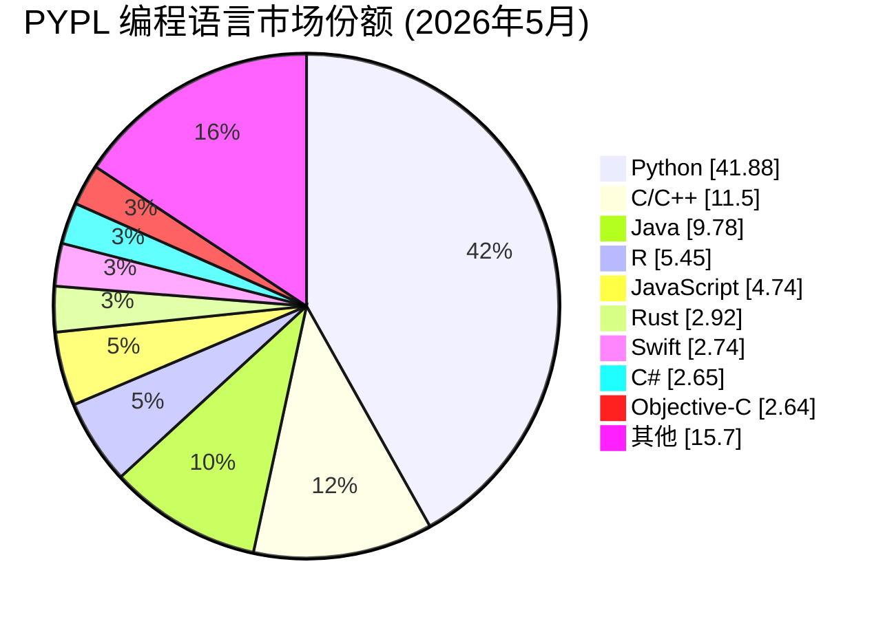
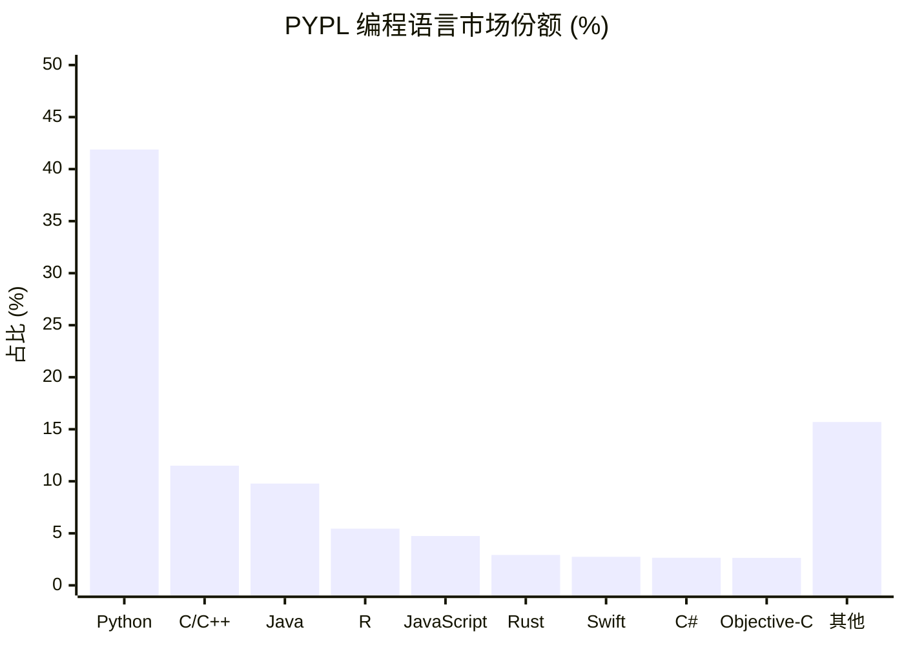
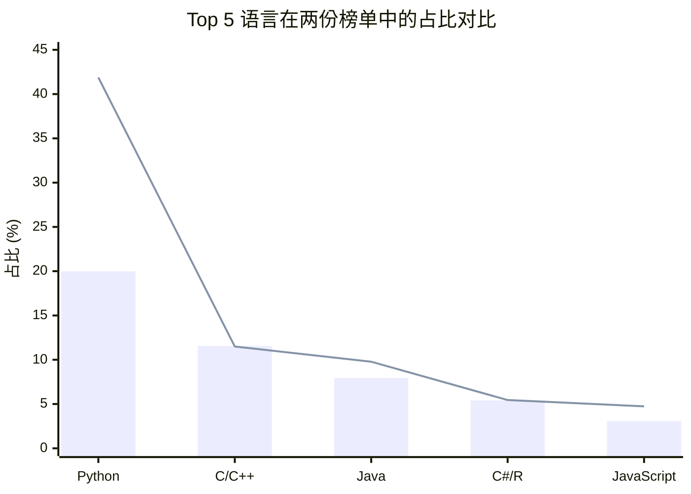

# 编程语言市场份额占比 (2026年5月)

> 数据来源：TIOBE Index & PYPL Index

---

## 一、TIOBE 指数 Top 10

TIOBE 指数基于全球工程师数量、课程和第三方供应商数量统计。

### 🥧 饼图

### 📊 横向柱状图

---

## 二、PYPL 指数 Top 10

PYPL 指数基于 Google 上语言教程的搜索频率统计。

### 🥧 饼图

### 📊 横向柱状图

---

## 三、Top 5 语言对比 (TIOBE vs PYPL)

> 蓝色柱状图 = TIOBE 数据  
> 红色折线图 = PYPL 数据

---

## 四、排名总表

| 排名 | 语言 | TIOBE 占比 | PYPL 占比 |
|:---:|:---|:---:|:---:|
| 🥇 1 | Python | 19.98% | 41.88% |
| 🥈 2 | C / C++ | 11.55% | 11.50% |
| 🥉 3 | Java | 7.94% | 9.78% |
| 4 | C++ | 7.92% | — |
| 5 | C# | 5.41% | 2.65% |
| 6 | JavaScript | 3.08% | 4.74% |
| 7 | R | 1.77% | 5.45% |
| 8 | Rust | 1.14% | 2.92% |
| 9 | Swift | 0.93% | 2.74% |
| 10 | TypeScript | 0.40% | 1.63% |

---

## 五、关键趋势

- **Python** 在两个榜单中均遥遥领先，PYPL 占比高达 **41.88%**
- **C/C++** 稳居第二，系统编程领域依然不可撼动
- **Java** 虽保持前三，但近年来呈下降趋势
- **Rust** 逐年上升，正成为系统编程的新宠
- **TypeScript** 在前端领域持续增长

> 数据更新于 2026年5月
